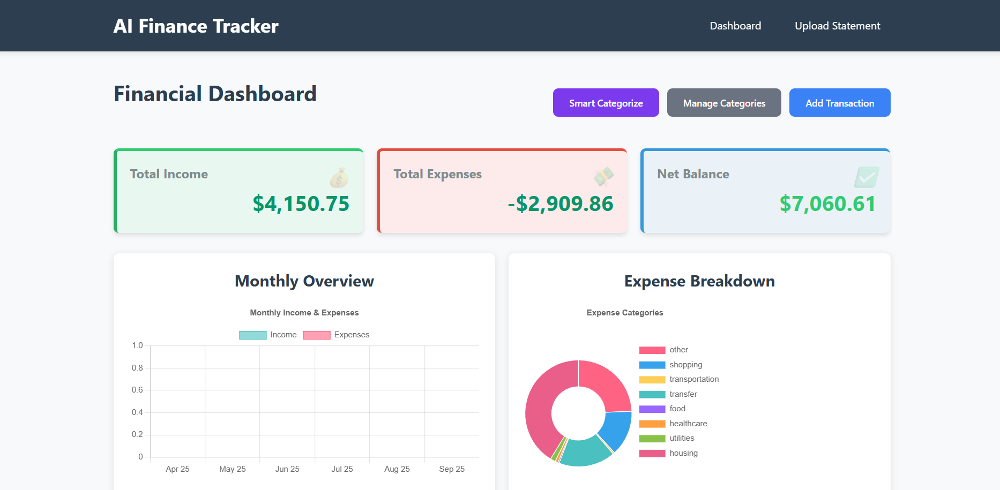
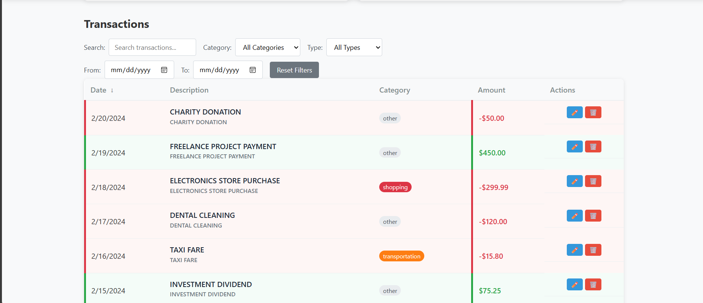
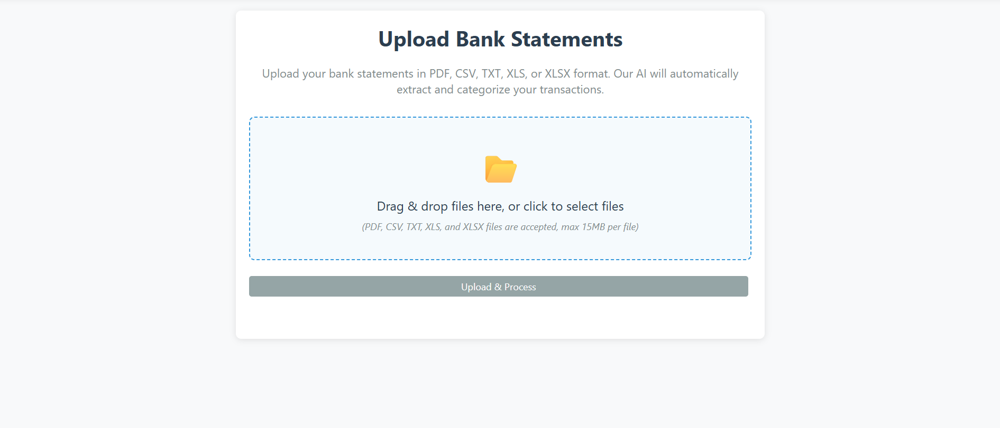

# Financial Transaction Processor

A full-stack MERN application for processing and analyzing bank statements with AI-powered transaction categorization and interactive dashboards.

## Screenshots




## Features

- **Multi-format File Upload**: Support for CSV, TXT, PDF, and Excel bank statements
- **AI-Powered Processing**: Automatic transaction extraction and categorization using OpenAI
- **Interactive Dashboard**: Real-time charts showing monthly income/expenses and category breakdowns
- **Smart Categorization**: Automatic categorization of transactions into predefined categories
- **Transaction Management**: View, edit, and manage all processed transactions
- **Responsive Design**: Modern, mobile-friendly user interface

## Tech Stack

### Frontend
- **React 18** - Modern UI library
- **Vite** - Fast build tool and development server
- **Chart.js** - Interactive charts and data visualization
- **Axios** - HTTP client for API requests
- **CSS3** - Modern styling

### Backend
- **Node.js** - JavaScript runtime
- **Express.js** - Web application framework
- **MongoDB** - NoSQL database
- **Mongoose** - MongoDB object modeling
- **Multer** - File upload handling
- **OpenAI API** - AI-powered transaction processing
- **PDF-Parse** - PDF text extraction
- **CSV-Parser** - CSV file processing

## 📋 Prerequisites

Before running this application, make sure you have the following installed:

- **Node.js** (v16 or higher)
- **MongoDB** (local installation or MongoDB Atlas)
- **OpenAI API Key** (for AI-powered transaction processing)

## Installation & Setup

### 1. Clone the Repository
```bash
git clone https://github.com/RahulkrWD/AI-Finance-Tracker.git
cd AI-Finance-Tracker
```

### 2. Backend Setup
```bash
cd server
npm install
```

Create a `.env` file in the server directory:
```env
PORT=5000
MONGODB_URI=mongodb://localhost:27017/financial-tracker
OPENAI_API_KEY=your_openai_api_key_here
```

### 3. Frontend Setup
```bash
cd ../client
npm install
```

Create a `.env` file in the client directory:
```env
VITE_API_URL=http://localhost:5000/api
```

### 4. Start the Application

**Start the backend server:**
```bash
cd server
npm start
```

**Start the frontend development server:**
```bash
cd client
npm run dev
```
## Project Structure

```
AI-Finance-Tracker/
├── client/                 # React frontend
│   ├── src/
│   │   ├── components/     # React components
│   │   ├── syles/          # CSS files (note: folder name as is)
│   │   ├── App.css         # Main app styles
│   │   ├── App.jsx         # Main App component
│   │   └── main.jsx        # Entry point
│   ├── public/             # Static assets
│   │   ├── index.html      # HTML template
│   │   ├── logo.svg        # App logo
│   │   └── manifest.json   # PWA manifest
│   ├── index.html          # Vite HTML template
│   ├── package.json        # Frontend dependencies
│   ├── vite.config.js      # Vite configuration
│   └── vercel.json         # Vercel deployment config
├── server/                 # Express backend
│   ├── config/             # Configuration files
│   │   └── db.js           # Database configuration
│   ├── models/             # MongoDB models
│   │   ├── Statement.js    # File upload model
│   │   └── Transaction.js  # Transaction model
│   ├── routes/             # API routes
│   │   ├── upload.js       # File upload endpoints
│   │   ├── process.js      # File processing logic
│   │   └── transactions.js # Transaction CRUD operations
│   ├── uploads/            # Uploaded files storage
│   ├── index.js            # Server entry point
│   ├── package.json        # Backend dependencies
│   └── vercel.json         # Vercel deployment config
├── screenshoot/            # Application screenshots
│   ├── dashboard.png       # Dashboard screenshot
│   ├── dashboard1.png      # Dashboard screenshot 2
│   └── upload.png          # Upload page screenshot
├── sample_bank_statement_1.csv  # Sample data files
├── sample_bank_statement_2.csv
├── sample_bank_statement_3.txt
└── README.md               # Project documentation
```

## 🎯 Usage

### 1. Upload Bank Statements
- Navigate to the upload section
- Select your bank statement files (CSV, TXT, PDF, or Excel)
- Click "Upload Files" to process them

### 2. View Dashboard
- Access the dashboard to see:
  - Monthly income vs expenses chart
  - Expense breakdown by category
  - Total income, expenses, and net balance
  - Recent transactions summary

### 3. Manage Transactions
- View all processed transactions
- Edit transaction details if needed
- Filter transactions by date, category, or type
- Add manual transactions

### 4. Auto-Categorization
- The system automatically categorizes transactions into:
  - Food & Dining
  - Transportation
  - Utilities
  - Entertainment
  - Shopping
  - Healthcare
  - Education
  - Housing
  - Income
  - Transfer
  - Other

## 📊 Supported File Formats

### CSV Files
Expected format:
```csv
Date,Description,Amount,Type,Balance
2024-01-15,GROCERY STORE PURCHASE,-85.50,Debit,2450.75
2024-01-16,SALARY DEPOSIT,3500.00,Credit,5950.75
```

### Text Files
Expected format:
```
01/15/2024 GROCERY STORE PURCHASE -85.50
01/16/2024 SALARY DEPOSIT 3500.00
```

### PDF Files
- Bank statement PDFs with transaction data
- Text extraction using PDF parsing

## 🔑 API Endpoints

### File Upload
- `POST /api/upload` - Upload bank statement files
- `GET /api/upload` - Get uploaded file list

### File Processing
- `POST /api/process` - Process uploaded files with AI

### Transactions
- `GET /api/transactions` - Get all transactions
- `GET /api/transactions/:id` - Get transaction by ID
- `POST /api/transactions` - Create new transaction
- `PUT /api/transactions/:id` - Update transaction
- `DELETE /api/transactions/:id` - Delete transaction
- `GET /api/transactions/category/:category` - Get transactions by category
- `GET /api/transactions/date-range` - Get transactions by date range

## 🤖 AI Processing

The application uses OpenAI's GPT-3.5-turbo model to:
- Extract transaction data from unstructured text
- Categorize transactions automatically
- Clean and normalize transaction descriptions
- Identify merchant names

If the OpenAI API is unavailable, the system falls back to regex-based extraction.

## 🎨 Features in Detail

### Dashboard Charts
- **Monthly Overview**: Bar chart showing income vs expenses over the last 6 months
- **Expense Breakdown**: Pie chart showing expense distribution by category

### Transaction Categories
- Automatic categorization based on merchant names and descriptions
- Manual category editing available
- Color-coded category visualization

### File Processing
- Supports multiple file formats simultaneously
- Batch processing of multiple files
- Error handling for corrupted or invalid files
- Progress tracking for large files

## 🔒 Security Considerations

- File uploads are validated and sanitized
- API keys are stored in environment variables
- Input validation on all endpoints
- Error handling to prevent information leakage

## Troubleshooting

### Common Issues

1. **MongoDB Connection Error**
   - Ensure MongoDB is running
   - Check the MONGODB_URI in your .env file

2. **OpenAI API Errors**
   - Verify your API key is valid
   - Check your OpenAI account quota
   - The system will fall back to regex processing if AI fails

3. **File Upload Issues**
   - Check file format is supported
   - Ensure file size is within limits
   - Verify file is not corrupted

## 📝 Contributing

1. Fork the repository
2. Create a feature branch
3. Make your changes
4. Add tests if applicable
5. Submit a pull request

## 📄 License

This project is licensed under the MIT License.

## 🙏 Acknowledgments

- OpenAI for AI-powered transaction processing
- Chart.js for data visualization
- MongoDB for database solutions
- React community for excellent documentation

---

For support or questions, please open an issue in the repository.